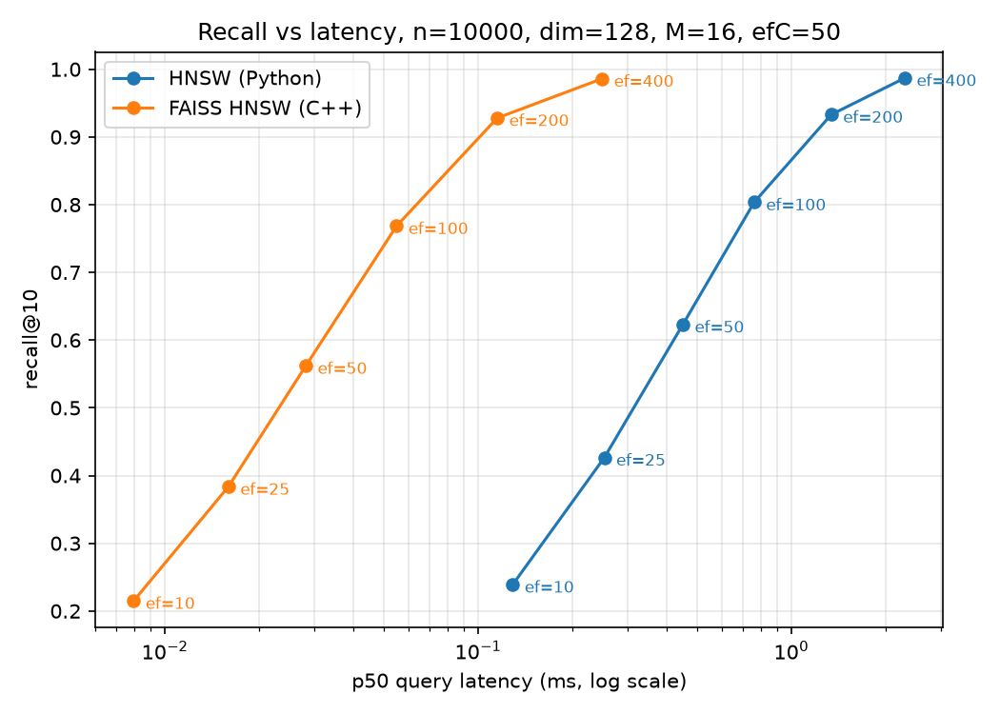

# Vector Retrieval Engine

A vector search engine built from scratch in Python: brute force and HNSW, benchmarked
against FAISS with recall measured against exact ground truth.

## What this is

I implemented brute force vector search and HNSW (Hierarchical Navigable Small World) from
scratch to understand what production vector databases like FAISS, Pinecone, and Weaviate do
under the hood. The project came out of my published RAG paper (IEEE MIT URTC 2025) where I
used FAISS as a black box. This is the answer to the question: do I actually know what FAISS
is doing?

## Benchmark results

Apple M5 Air, 24GB RAM, Python 3.12, numpy 2.5.2, faiss-cpu 1.15.0 pinned to one thread.
dim=128, top_k=10, 2000 queries over an i.i.d. Gaussian corpus normalized to unit length.
Recall@10 is measured against exact inner-product ground truth (IndexFlatIP). Produced by
`python compare.py --n 10000` and `--n 100000`. Latencies on a working laptop drift by tens
of percent between runs; read the ratios, not the third decimal. Where a comparison is
load-bearing, this README cites interleaved best-of-3 runs from a single process and says so.

| Algorithm            | p50 @ 10k | recall@10 @ 10k | p50 @ 100k | recall@10 @ 100k |
|----------------------|-----------|-----------------|------------|------------------|
| BruteForce (Python)  | 0.09 ms   | 1.000           | 4.11 ms    | 1.000            |
| HNSW (Python, mine)  | 0.77 ms   | 0.601           | 1.52 ms    | 0.180            |
| FAISS Flat (C++)     | 0.11 ms   | 1.000           | 2.77 ms    | 1.000            |
| FAISS HNSW (C++)     | 0.05 ms   | 0.563           | 0.19 ms    | 0.164            |

An earlier version of this README headlined a 347x speedup of FAISS HNSW over Python brute
force at 1M vectors. That number compared two indexes I did not write, against a brute force
whose query path wasted time recomputing corpus norms on every call, and it came out of a
harness that called `.search()` twice per FAISS query (inflating every FAISS latency 1.67x)
and read percentiles one rank too high. All numbers above come from the fixed harness. The
table stops at n=100k: a 100k build takes 153 to 287 s in a Python loop depending on machine
load, which extrapolates to roughly an hour at 1M.

Two things in this table deserve attention. First, my brute force matches FAISS Flat at 10k
(0.09 versus 0.11 ms): a single matmul over a contiguous unit-norm numpy matrix runs on
Apple's Accelerate BLAS, and at a size that stays cache-friendly that is hard to beat from a
per-query C++ scan. FAISS Flat pulls ahead at 100k. Second, both HNSW implementations
collapse to under 0.19 recall at 100k. That is not a bug in either one; it is what a fixed
ef_search of 50 does when the graph grows 10x, and it is the subject of the next sections.

## My HNSW versus FAISS HNSW

At matched M=16, efConstruction=50, efSearch=50, n=10k: my index scores 0.601 recall@10 to
FAISS's 0.563, and FAISS answers about 15x faster (0.05 versus 0.77 ms p50). The speed gap
is C++ with SIMD and cache-friendly layout versus a Python interpreter loop; both walk the
same layered-graph algorithm. The recall gap is a deliberate wiring choice, measured in
"Two wiring decisions" below. At 100k the recall ordering holds (0.180 mine, 0.164 FAISS).

## ef_search is an operating point, not a constant

Sweep of ef_search over [10, 25, 50, 100, 200, 400] at n=10k, both implementations at
matched M=16 and efConstruction=50, ground truth from IndexFlatIP, 200 queries
(`python benchmarks/recall_curve.py`):

| ef_search | HNSW (Python) recall@10 | HNSW (Python) p50 | FAISS HNSW recall@10 | FAISS HNSW p50 |
|-----------|-------------------------|-------------------|----------------------|----------------|
| 10        | 0.239                   | 0.129 ms          | 0.215                | 0.008 ms       |
| 25        | 0.426                   | 0.253 ms          | 0.384                | 0.016 ms       |
| 50        | 0.623                   | 0.451 ms          | 0.562                | 0.028 ms       |
| 100       | 0.803                   | 0.761 ms          | 0.768                | 0.055 ms       |
| 200       | 0.933                   | 1.341 ms          | 0.928                | 0.115 ms       |
| 400       | 0.987                   | 2.302 ms          | 0.986                | 0.249 ms       |

Both curves climb the same shape; the horizontal offset is the constant-factor language gap.
My curve sits slightly above FAISS at every point. Quoting a recall number without its ef is
meaningless; pick the operating point the application needs.

A note on absolute recall: an i.i.d. Gaussian corpus in 128 dimensions makes nearest
neighbours nearly indistinguishable. The mean similarity margin between the true rank-1 and
rank-10 neighbour is 0.063 at n=10k and 0.053 at n=100k on this data, so recall@10 looks
pessimistic here for every method compared to real embedding corpora, which have cluster
structure.

## What happens at 100k, and where the crossover really sits

Measured in one process, interleaved, best of 3 passes, 200 queries:

| Operating point           | p50      | recall@10 |
|---------------------------|----------|-----------|
| BruteForce (exact)        | 1.98 ms  | 1.000     |
| HNSW ef=50                | 1.04 ms  | 0.186     |
| HNSW ef=100               | 1.78 ms  | 0.301     |
| HNSW ef=200               | 3.47 ms  | 0.464     |
| HNSW ef=400               | 7.01 ms  | 0.662     |

At 100k my HNSW is only faster than brute force at operating points that return garbage. At
equal latency (ef between 100 and 200) it finds under half of the true top-10. Matching the
recall of the 10k operating point, about 0.62, requires ef=400 and runs 3.5x slower than the
exact scan. The graph index has not usefully crossed over by 100k on this corpus at all.

That statement used to be very different, and the difference is the bug. Before this round
of fixes, `VectorStore.search` recomputed every corpus norm on every query, dragging its p50
from 0.53 to a measured 6.57 ms at 100k (paired best-of-3: fixed version 0.08 and 1.25 ms at
10k and 100k). Against that handicapped baseline, my HNSW at ef=50 broke even around n=13k,
interpolating the measured brute-force line, and the old README treated the approximate
index as the obvious winner from 10k up. The early crossover was a property of the bug, not
of the algorithms. The honest lesson: a correct exact scan over a contiguous matrix is hard
to beat until the corpus is far larger than the broken baseline suggested, and when the
graph does win on raw latency, check what recall it is winning at.

## Two wiring decisions, measured

Both measured at n=10k, ef=50, topology seed 42, paired best-of-3 runs.

**Layer-0 link count.** The paper's Algorithm 1 gives a newly inserted node M links at every
layer and uses M_max0=2M only as the pruning cap on existing nodes. My default gives the new
node M_max0=32 links at layer 0, which saturates the bottom layer: mean out-degree 32.0
versus 25.4 under the paper's rule. Measured: recall@10 0.623 versus 0.545, p50 0.73 versus
0.65 ms, build 6.9 versus 7.8 s. The saturated version ships as the default
(`layer0_full_links=True`) because it buys 0.078 recall for about 13% query latency; the
paper's behavior stays behind the flag. This one flag also explains most of my recall edge
over FAISS: under the paper's rule my index lands at 0.545, within 0.02 of FAISS's 0.563.

**Neighbor selection heuristic.** The paper's Algorithm 4 keeps a candidate only if it is
closer to the query than to any already-selected neighbor, preserving long-range links
between clusters, and refills from the pruned pile up to M. Implemented behind
`heuristic_select=True`. Measured effect: recall@10 0.623 to 0.619 on topology seed 42, and
0.616 to 0.622 on seed 7, at about 6x the build time in this implementation. The delta is
inside seed-to-seed noise because this corpus is i.i.d. Gaussian: there are no clusters
whose bridge links the heuristic could protect. Plain nearest-M ships as the default here.
On clustered real-world embeddings the heuristic is the right choice, which is why hnswlib
and FAISS use it.

## Deletes do not exist in HNSW

Re-adding an existing doc_id tombstones the old node: it stays in the graph as a routing
waypoint and is filtered out of results, so a doc can never appear twice. This mirrors
production systems: HNSW has no clean delete, so real deployments tombstone and periodically
rebuild the index. `len(index)` counts live docs. `search` guarantees exactly
min(top_k, len(index)) results, brute-forcing the remainder in the rare case the graph walk
comes back short.

## The five questions I can answer cold

1. The brute force index is a numpy matrix, normalized once at insert. Search is one matrix
   multiply plus argpartition. O(n) per query, exact results.

2. HNSW builds a layered directed graph. It trades recall for roughly O(log n) query time.
   ef_search moves along the recall/latency curve at query time without rebuilding.

3. The harness times each query with time.perf_counter and reports p50/p95/p99 through
   np.percentile. Percentiles matter because tail latency is what users feel. The old
   index-based percentile read one rank high at every level, and at 100 queries reported
   the maximum as p99.

4. My HNSW beats FAISS HNSW on recall at matched parameters (0.601 versus 0.563 at ef=50,
   n=10k) because it wires a new node with M_max0=32 links at layer 0 where the paper
   assigns M=16. Flip that one flag and my recall drops to 0.545, next to FAISS. The edge
   is denser bottom-layer wiring paid for at build time, not smarter search; the 15x speed
   gap the other way is C++ versus interpreter, not algorithm.

5. FAISS wins on speed through vectorized C++ and cache-friendly layout. My implementation
   exists to prove the algorithm is understood, not to replace FAISS.

## Project structure

    vecstore/store.py            Brute force index, unit-norm matrix, doubling buffer
    vecstore/hnsw.py             HNSW index, tombstoned re-adds, two wiring flags
    benchmarks/harness.py        p50/p95/p99 latency measurement
    benchmarks/recall_curve.py   ef_search sweep, markdown table + plot
    evaluation/metrics.py        Precision@K, Recall@K, MRR
    compare.py                   Latency + recall runner for all four indexes
    tests/                       pytest suite

## How to run

    python3 -m venv venv
    ./venv/bin/pip install numpy faiss-cpu pytest hypothesis matplotlib
    ./venv/bin/python -m pytest
    ./venv/bin/python compare.py --n 100000
    ./venv/bin/python benchmarks/recall_curve.py

The test suite covers an exactness check of brute-force search against a pure-Python cosine
reference over 200 queries, hypothesis property tests over the graph invariants (degree
caps, layer nesting, entry point placement, layer-0 BFS reachability) and the search
contract (arity, ordering, uniqueness, score bounds), edge cases (empty index, single
vector, top_k > n, zero vectors, duplicate vectors, duplicate doc_ids, dim mismatch), and a
recall@10 >= 0.55 regression gate at n=10k ef=50 so a refactor that quietly breaks the
graph fails the build.
